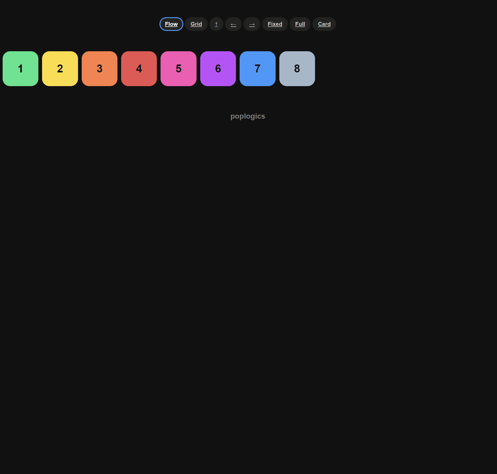

# *Responsive Layout*
*Twitter like button with animations*



### *Technologies* :
- [*Hooks*](https://reactjs.org/docs/hooks-intro.html)
- [*SCSS*](https://sass-lang.com/)

### *Installation process* :
- clone repo
- navigate to project root folder
- install all dependencies with yarn or npm i
- run with yarn start or npm

```bash
$ git clone https://github.com/RandolphG/Twitter-Heart
$ cd project folder
$ yarn or npm i
$ yarn start or npm start
```

## *Testing with Jest*
- install jest
- navigate to project root folder
- run jest

```bash
$ yarn add -global jest
$ cd project folder
$ jest
```

## *Application Sections*

Application is split mainly in one part.
- Heart Animaiton
